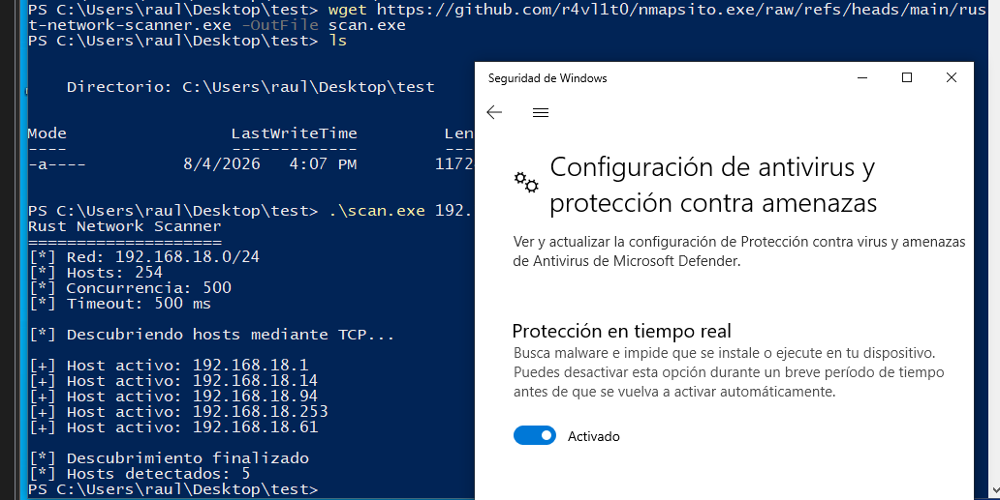

1. Descubrir hosts
```
sudo ./target/release/rust-network-scanner \
  192.168.18.0/24 \
  --sn

Ejemplo de resultado:

[+] Host activo: 192.168.18.1
[+] Host activo: 192.168.18.20
[+] Host activo: 192.168.18.35
```
2. Escanear puertos comunes
```
./target/release/rust-network-scanner \
  192.168.18.0/24 \
  -F
```
3. Escanear todos los puertos
```
./target/release/rust-network-scanner \
  192.168.18.20/32 \
  -p-
```


